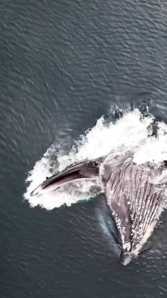
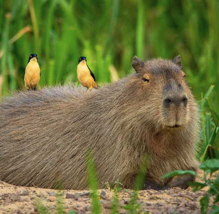
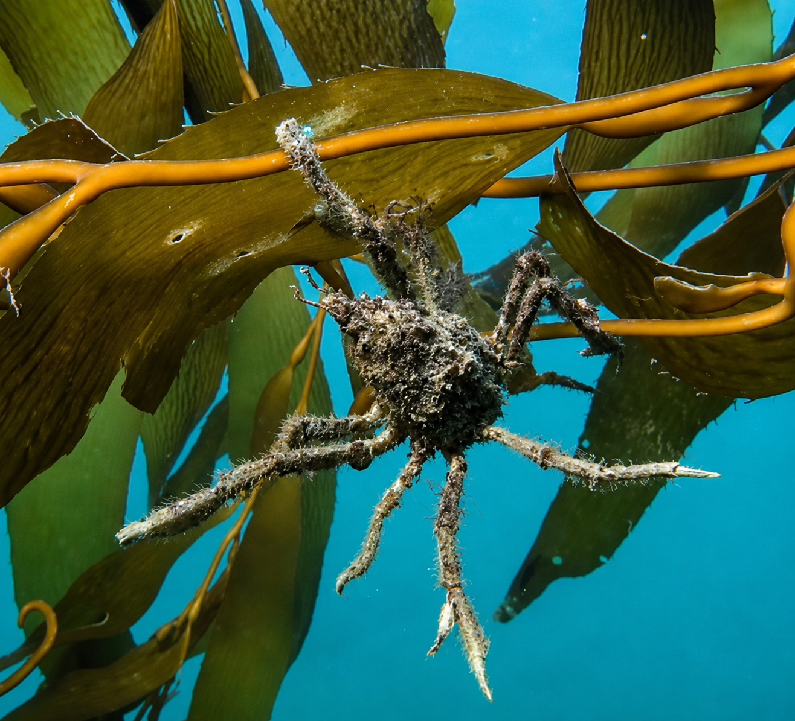
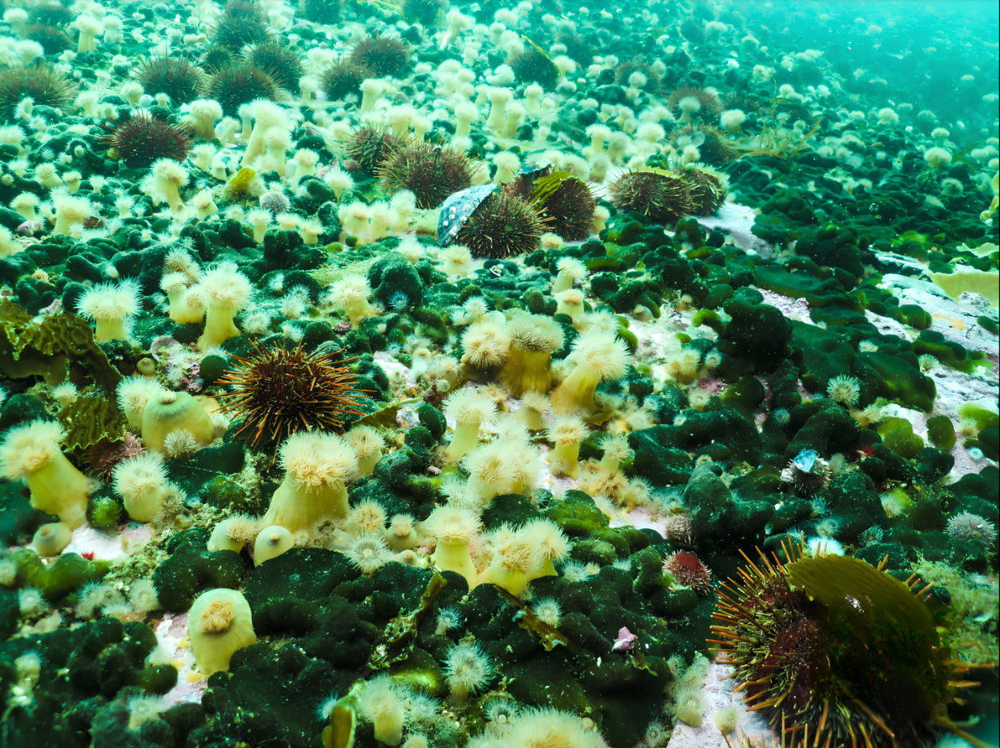

```{r setup, include=FALSE}
options(htmltools.dir.version = FALSE)
knitr::opts_chunk$set(echo = FALSE, warning = FALSE, message = FALSE)
require(multiweb)
require(igraph)

# helper para no repetir el bloque de saveWidget + iframe centrado/transparente
insertar_widget <- function(w, archivo, height_px = 400, width_pct = 80) {
  htmlwidgets::saveWidget(w, archivo, selfcontained = TRUE)

  # saveWidget agrega un fondo blanco al <body>; lo reemplazamos para que
  # el iframe deje ver el fondo de la diapositiva.
  html <- readLines(archivo, warn = FALSE)
  html <- sub(
    '<body style="background-color: white;">',
    '<body style="background-color: transparent;">',
    html,
    fixed = TRUE
  )
  html <- sub(
    "</head>",
    "<style>html,body,#htmlwidget_container{background:transparent !important;}</style></head>",
    html,
    fixed = TRUE
  )
  writeLines(html, archivo)

  cat(htmltools::div(
    style = "display:flex; justify-content:center;",
    htmltools::tags$iframe(
      src = archivo,
      width = paste0(width_pct, "%"),
      height = height_px + 30,
      frameborder = "0",
      style = "border:none; background:transparent;"
    )
  ) |> as.character())
}

```
class: inverse, title-slide, center

.kicker[Laboratorio de Ecología y Sistemas Complejos · CADIC-CONICET]

# ¿<span class="accent-como">Te como</span> o <span class="accent-ayudo">te ayudo</span>?

### Interacciones: cómo se conectan las especies

<br>

**Dr. Leonardo A. Saravia - @leosarush** - CADIC-CONICET 

<br>
<br>
<br>
<br>
<br>
<br>

.footline[
Con el auspicio de **Ushuaia Shipping** · ushuaiashipping.com
]

---

## ¿Qué hacemos?

.subtitle[Laboratorio de Ecología y Sistemas Complejos, CADIC-CONICET (Ushuaia)]

.columns[
.col[
.card[
### 🐋 El enfoque tradicional

Muchas/os científicas/os se especializan en **una especie o un grupo afín**
— por ejemplo mamíferos marinos o aves marinas — y profundizan en
su biología en detalle.
]
]

.col[
.card-dark[
### 🕸️ Nuestro enfoque

Nosotros miramos más el **ecosistema completo**:
muchas especies a la vez y **cómo interactúan entre sí**.
]
]
]

.center[https://cadic.conicet.gov.ar/laboratorio-de-ecologia-y-sistemas-complejos/]
---

### ¿Qué tipos de interacciones existen?

.card-grid[
.card[

<div class="card-title">Depredación</div>
<div class="card-tag tag-como">"Te como"</div>
<div class="card-desc">Una especie se alimenta de otra (ej. ballena que come krill).</div>
]

.card[

<div class="card-title">Mutualismo</div>
<div class="card-tag tag-ayudo">"Te ayudo"</div>
<div class="card-desc">Ambas especies se benefician (ej. limpieza, protección mutua).</div>
]
.card[

<div class="card-title">Comensalismo</div>
<div class="card-tag tag-comensal">"Me aprovecho, no te afecto"</div>
<div class="card-desc">Una que provee habitat para otra.</div>
]
.card[

<div class="card-title">Competencia</div>
<div class="card-tag tag-compete">"Ambas perdemos"</div>
<div class="card-desc">Dos especies compiten por el mismo recurso (alimento, espacio).</div>
]
]
---
class: inverse, top, center
background-image: url(Images/CamposDeAnemonasPlumosas.png)
background-size: contain

---
class: inverse, top
background-image: url(Images/CamposDeAnemonasPlumosasConBabosas.png)
background-size: contain
---
class: inverse, middle
background-image: url(Images/CamposDeAnemonasPlumosasOpaco.png)
background-size: contain
```{r slide4, echo=FALSE, results='asis'}
# ---- 1. Estructura de la red -----------------------------------
g_foto <- graph_from_literal(
  Erizo +- Codium,          # depredacion: erizo come codium
  Codium +-+ Anemona,       # competencia (simetrica) por espacio/sustrato
  Codium -+ Babosas,         # provision de habitat: el campo de anemonas alberga babosas chicas
  Erizo +- Cachiyuyo          # depredacion: erizo come codium
  )

# ---- 2. Tipo de interaccion por arista ---------------------------
# El orden tiene que coincidir con el orden en que graph_from_literal
# genero las aristas (Codium +-+ Anemona genera 2 aristas: Codium->
# Anemona y Anemona->Codium, en ese orden).
E(g_foto)$tipo  <- c("depredacion", "competencia", "habitat", "competencia", "depredacion")
#E(g_foto)$color <- c("firebrick", "grey40", "grey40", "steelblue")

# Colores y tamaños definidos en el objeto igraph
colores_nodo <- c(
  Erizo     = "#4A2523", # erizo oscuro
  Codium    = "#315C32", # verde profundo
  Anemona   = "#F3DEA3", # crema de las anémonas
  Babosas   = "#D9D7C6", # blanco-grisáceo
  Cachiyuyo = "#7C8628"  # verde oliva
)

V(g_foto)$color <- unname(colores_nodo[V(g_foto)$name])
# ---- 4. Graficar ----------------------------------------------------
w <- plot_troph_level_visNet_multi(g_foto, physics = "full",
                              layer_attr = "tipo",
                              trophic_layer="depredacion",
                              layer_dashed ="competencia",
                              height = "470px",search=FALSE,legend=FALSE)


htmlwidgets::saveWidget(w, "beagle_ej1.html", selfcontained = TRUE)

# ---- 4. Insertar centrado y con fondo transparente ----------------------
insertar_widget(w, "beagle_ej1.html", height_px = 500)
```

---
## ¿Quién es más importante en la red?
.subtitle[Una métrica simple: el grado (número de conexiones de un nodo)]
.columns[
.col[
```{r slide-grado, echo=FALSE, results='asis'}
insertar_widget(w, "beagle_ej1.html", height_px = 500)

```
]
.col[
.card-dark[
### 🔗 El nodo más conectado

En esta red, **Codium** tiene el mayor grado (**4 conexiones**):
es consumido por el erizo, compite en ambos sentidos con las anémonas
y ofrece hábitat a las babosas.

Conecta interacciones tróficas y no tróficas

También hay que considerar si la especie es **abundante**
]
]
]

---

<video width="100%" height="600" controls autoplay loop>
  <source src="Images/CondoresComiendoBallenato.mp4" type="video/webm">
  Tu navegador no soporta el formato de video HTML5.
</video>
---
<video width="100%" height="600" controls autoplay loop>
  <source src="Images/BosquesArribaABajo.mp4" type="video/webm">
  Tu navegador no soporta el formato de video HTML5.
</video>

---

```{r slide-macrocystis-habitat, echo=FALSE, results='asis'}
no_troficas <- data.frame(
  source = "Macrocystis pyrifera",
  target = c(
    "Amphipoda", "Isopoda", "Pseudechinus magellanicus",
    "Bivalvia", "Gastropoda", "Polyplacophora", "Bryozoa",
    "Membranipora isabelleana", "Porifera", "Nemertea",
    "Polychaeta", "Ophiuroidea", "Cirripedia",
    "Patagonotothen cornucola", "Patagonotothen sima", "Harpagifer bispinis",
    "Halicarcinus planatus", "Lithodes santolla"
  ),
  tipo = "habitat",
  stringsAsFactors = FALSE
)

g_kelp <- graph_from_data_frame(no_troficas, directed = TRUE)

V(g_kelp)$label <- V(g_kelp)$name

V(g_kelp)$label <- ifelse(
  V(g_kelp)$name == "Macrocystis pyrifera",
  "Cachiyuyo",
  V(g_kelp)$name
)
# V(g_kelp)$color <- ifelse(V(g_kelp)$name == "Macrocystis pyrifera", "seagreen", "lightblue")
# V(g_kelp)$size  <- ifelse(V(g_kelp)$name == "Macrocystis pyrifera", 40, 20)
# E(g_kelp)$color <- "steelblue"
# E(g_kelp)$width <- 2

w <- plot_troph_level_visNet_multi(g_kelp, physics = "full",
                              layer_attr = "tipo",
                              trophic_layer = "habitat",
                              height = "440px",search=FALSE,legend=FALSE)
insertar_widget(w, "beagle_kelp_habitat.html", height_px = 440)
```
### Cachiyuyo: es comida y hogar
.subtitle[El cachiyuyo no solo alimenta — su grampón y fronda dan refugio a decenas de especies]

---
class: center

```{r slide-red-multiplex, echo=FALSE, results='asis'}
# ---- reutiliza no_troficas y norm() del chunk anterior; asume que
# 'b' (la red trofica completa, 166 especies) ya esta cargada desde
# algun chunk previo del deck ----
b <- readNetwork("BeagleChannel_links_standarized_actualizado.csv", edgeListFormat = 2)

importantes <- c(
  "Macrocystis pyrifera",
  "Grimothea gregaria",        # antes: Munida gregaria
  "Lithodes santolla",
  "Eleginops maclovinus",
  "Odontesthes nigricans",
  "Paranotothenia magellanica",
  "Mytilus edulis",            # antes: Mytilus edulis chilensis
  "Perumytilus purpuratus",
  "Nacella magellanica",
  "Phalacrocorax atriceps",
  "Larus dominicanus",
  "Lontra provocax",
  "Megaptera novaeangliae",
  "Codium sp",
  "Loxechinus albus",
  "Arbacia dufresnii",
  "Pseudechinus magellanicus",
  "Gastropoda"
)
nombres <- c(
  "Cachiyuyo",
  "Langostilla",
  "Centolla",
  "Róbalo",
  "Pejerrey",
  "Nototenido",
  "Mejillón",
  "Mejillín",
  "Lapa",
  "Cormorán imperial",
  "Gaviota cocinera",
  "Huillín",
  "Ballena jorobada",
  "Codium",
  "Erizo rojo",
  "Erizo negro",
  "Erizo magallánico",
  "Caracoles y babosas marinas"
)

norm <- function(x) trimws(gsub("[._]+", " ", x))
idx <- match(norm(importantes), norm(V(b)$name))
if (any(is.na(idx))) {
  warning("No se encontraron en el grafo: ",
          paste(importantes[is.na(idx)], collapse = ", "))
}
V(b)$label <- ""
V(b)$label[idx[!is.na(idx)]] <- nombres[!is.na(idx)]


b_multiplex <- b
idx_from <- match(norm(no_troficas$source), norm(V(b_multiplex)$name))
idx_to   <- match(norm(no_troficas$target), norm(V(b_multiplex)$name))
nuevas_aristas <- as.vector(rbind(idx_from, idx_to))
b_multiplex <- add_edges(b_multiplex, nuevas_aristas,
                          attr = list(tipo = "habitat"))

# marcar el resto de las aristas preexistentes como troficas
# (solo si el atributo no existia previamente)
if (is.null(E(b)$tipo)) {
  E(b_multiplex)$tipo[is.na(E(b_multiplex)$tipo)] <- "trofica"
}

# destacar Macrocystis para que se ubique facil en una red de 166 nodos
# V(b_multiplex)$color <- ifelse(norm(V(b_multiplex)$name) == "Macrocystis pyrifera",
#                                 "seagreen", "lightblue")
# V(b_multiplex)$size  <- ifelse(norm(V(b_multiplex)$name) == "Macrocystis pyrifera",
#                                 35, 12)

w <- plot_troph_level_visNet_multi(
  b_multiplex,
  layer_attr = "tipo",
  trophic_layer = "trofica",
  layer_dashed = "habitat",
  physics = "full",
  height = "470px",search=FALSE,legend=FALSE
)
insertar_widget(w, "beagle_red_multiplex.html", height_px = 470)
```

#### La red trófica + no trófica (habitat)

---
class: inverse, middle
background-image: url(Images/CentollaEnElBeagle_ArgentinaSubmarina.png)
background-size: contain

---
class: inverse, middle
background-image: url(Images/CentollaEnElBeagleConLarva.png)
background-size: contain
---
class: inverse

## Un problema real: la centolla no se recupera

--

### <span class="tag-comensal">Es un recurso pesquero importante para la economía de Ushuaia.</span>

--

### Veda de pesca entre **1992 y 2014**

--
### <span class="tag-compete">  Actualmente hay una  **regulación de la pesquería**.</span>

--
### Sin embargo, **la población no se recuperó** 

--
### **<span class="tag-como">¿por qué la veda no alcanza?</span>**


---
class: 
```{r slide-hipotesis-centolla, echo=FALSE, results='asis'}

library(igraph)

#-------------------------------
# Nodos
#-------------------------------

nodos <- data.frame(
  name = c(
    "Pesca",
    "Centollas\nadultas",
    "Juveniles",
    "Larvas",
    "Peces\nplanctívoros",
    "Peces\nbentónicos",
    "Pulpos"
  )
)

#-------------------------------
# Enlaces
# Convención:
#   Depredación: presa -> depredador
#   Proceso poblacional: estadio -> estadio siguiente
#-------------------------------

enlaces <- data.frame(

  from = c(
    "Larvas",
    "Juveniles",

    "Larvas",
    "Larvas",
    "Juveniles",
    "Juveniles",
    "Juveniles",

    "Pesca"
  ),

  to = c(
    "Juveniles",
    "Centollas\nadultas",

    "Peces\nplanctívoros",
    "Medusas",
    "Peces\nbentónicos",
    "Pulpos",
    "Centollas\nadultas",

    "Centollas\nadultas"
  ),

  tipo = c(
    "proceso",
    "proceso",

    "hipotesis",
    "hipotesis",
    "depredacion",
    "depredacion",
    "depredacion",

    "pesca"
  ),

  etiqueta = c(
    "desarrollo",
    "maduración",

    "depredación",
    "depredación",
    "depredación",
    "depredación",
    "canibalismo",

    "extracción"
  )
)

# Agregar nodo Medusas
nodos <- rbind(nodos,
               data.frame(name="Medusas"))

g <- graph_from_data_frame(enlaces,
                           directed=TRUE,
                           vertices=nodos)

#-------------------------------
# Colores
#-------------------------------

V(g)$label <- V(g)$name

V(g)$color <- c(

"Pesca"="steelblue",

"Centollas\nadultas"="tomato",

"Juveniles"="gold",

"Larvas"="khaki",

"Peces\nplanctívoros"="dodgerblue4",

"Peces\nbentónicos"="forestgreen",

"Pulpos"="mediumpurple4",

"Medusas"="turquoise3"

)[V(g)$name]

E(g)$color <- c(
"depredacion"="tomato",
"hipotesis"="darkorange",
"proceso"="midnightblue",
"pesca"="steelblue4"
)[E(g)$tipo]

E(g)$width <- ifelse(E(g)$tipo=="proceso",4,3)

# Las hipótesis se dibujan punteadas
E(g)$dashes <- E(g)$tipo=="hipotesis"

E(g)$label <- E(g)$etiqueta

#-------------------------------
# Graficar
#-------------------------------

w <- plot_troph_level_visNet_multi(
      g,
      physics="full",
      layer_attr="tipo",
      trophic_layer="depredacion",
      layer_dashed=c("proceso","pesca","hipotesis"),
      search=FALSE,
      height="440px", legend=FALSE
)

insertar_widget(
    w,
    "beagle_centolla_hipotesis.html",
    height_px=440
)
```
### La red puede explicar lo que la pesca sola no explica
.subtitle[La pesca reduce los reproductores mientras la red ecológica regula el reclutamiento.]

---
class: inverse, center, middle
# ¿<span class="accent-como">Te como</span> o <span class="accent-ayudo">te ayudo</span>?

### <span class="tag-comensal">Las redes nos sirven para identificar especies clave.</span>
--

#### <span class="accent-como">Estudiar como reaccionan los ecosistemas a las perturbaciones (cambio de temperatura)</span>
--

### Para saber cómo se regulan las poblaciones de interés.
--

### <span class="accent-ayudo">Para encontrar las conexiones entre el ecosistema y la sociedad.</span>

---
class: inverse

## <span class="accent-como">Laboratorio de Ecología</span> y <span class="accent-ayudo">Sistemas Complejos</span>  

.center[
### CADIC-CONICET 
]

Integrantes: 
Tomás I. Marina · María Piotto · Leonardo A. Saravia

https://cadic.conicet.gov.ar/laboratorio-de-ecologia-y-sistemas-complejos/

<br>
<br>
<br>

--
#### Créditos de las fotos y videos

 * Beagle Secretos del mar @beaglesecretosdelmar
 
 * Argentina Submarina @argentinasubmarina
 
 * Federico Tapella
 
 * Bravo, G., et al. (2023). Roving Diver Survey as a Rapid and Cost-Effective Methodology to Register  Species Richness in Sub-Antarctic Kelp Forests. Diversity, 15(3), 354. https://doi.org/10.3390/d15030354


---
class: inverse, top
background-image: url(Images/malvinas-2026-1200x628.gif)
background-size: contain

